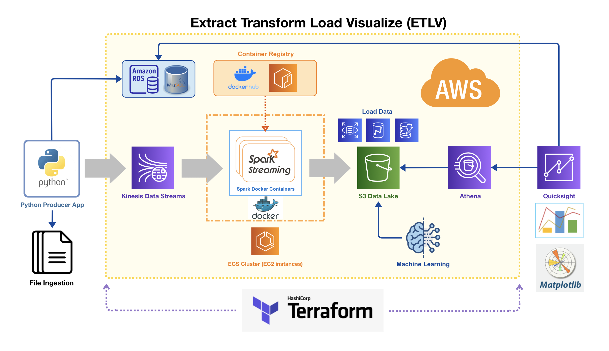

# Terraform Infrastructure

## Modules

* [./modules/dynamodb](./modules/dynamodb/README.md)
* [./modules/ecs](./modules/ecs/README.md)
* [./modules/iam](./modules/iam/README.md)
* [./modules/kinesis](./modules/kinesis/README.md)
* [./modules/kinesis-retry](./modules/kinesis-retry/README.md)
* [./modules/lambda](./modules/lambda/README.md)
* [./modules/rds](./modules/rds/README.md)
* [./modules/s3](./modules/s3/README.md)
* [./modules/spark](./modules/spark/README.md)
* [./modules/sqs](./modules/sqs/README.md)
* [terraform-aws-modules/vpc/aws](https://registry.terraform.io/modules/terraform-aws-modules/vpc/aws/latest)

## Variables

* `aws_region` - AWS region for the ECS cluster
* `dynamodb_table_name` - name of dynamodb table
* `dynamodb_read_capacity` - read capacity units for table (default 5)
* `dynamodb_write_capacity` - write capacity units for table (default 5)
* `kinesis_shard_count` - number of shards for Kinesis
* `kinesis_retry_cfn_stack_name` - name of the Cloudformation stack
* `kinesis_retry_cfn_docker_image` - Docker image to use for ECS task
* `key_name` - name of key pair for EC2 SSH access
* `ec2_instance_type` - type of EC2 container instance
* `s3_bucket_name` - name of the s3 bucket to load location data
* `lambda_enabled` - whether to include lambda consumer
* `rds_enabled` - whether to create the RDS instance
* `rds_username` - mysql database username
* `rds_password` - mysql database password
* `rds_publicly_accessible` - whether the RDS instance is publicly available
* `rds_db_name` - name of the database in the rds instance
* `spark_enabled` - whether Spark is enabled
* `spark_cfn_stack_name` - name of the CloudFormation stack
* `spark_cfn_docker_image` - Docker image to be used for task
* `spark_cfn_s3_bucket_name` - S3 bucket for Spark to load data
* `spark_ecs_cluster_name` - ECS cluster to put Spark
* `sqs_queue_name` - name of the SQS queue`

## Outputs

* `dynamodb_table_name` - the name of the dynamodb table
* `s3_bucket_domain` - public DNS of the S3 bucket
* `s3_bucket_name` - name of the S3 bucket
* `rds_endpoint` - the endpoint for the RDS instance (host:port)
* `sqs_failover_queue_url` - URL for SQS queue
